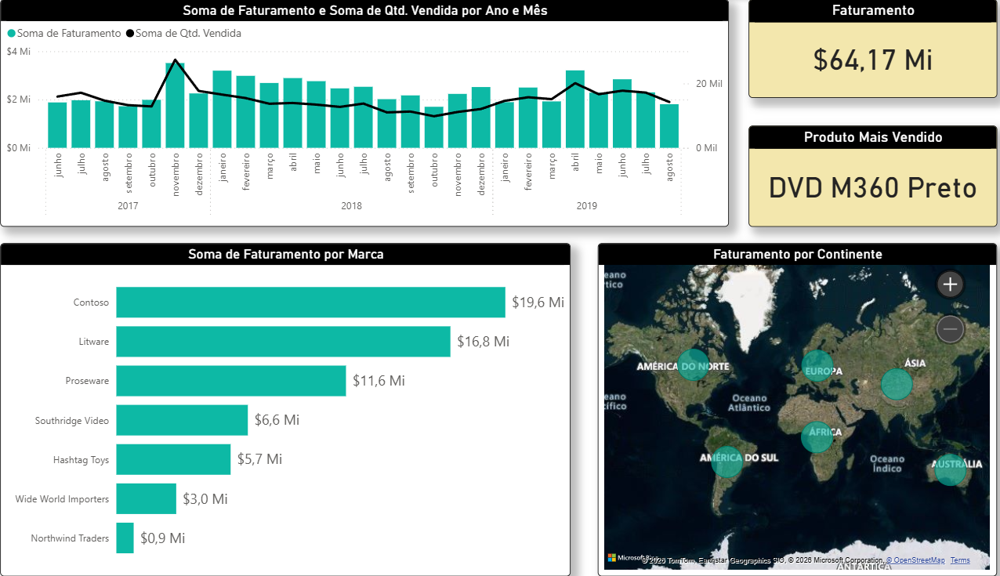

# 📊 Dashboard de Vendas - Power BI

## 📌 Sobre o projeto

Este projeto consiste na construção de um dashboard interativo no Power BI para análise de vendas.

O objetivo é transformar dados em informações visuais que auxiliem na tomada de decisão.

---

## 📊 Principais análises

* Faturamento total
* Quantidade de produtos vendidos ao longo do tempo
* Produto mais vendido
* Desempenho por marca
* Distribuição geográfica das vendas

---

## 🛠️ Ferramentas utilizadas

* Power BI
* DAX
* Modelagem de dados

---

## 📷 Preview do Dashboard

---

## 🎯 Objetivo

Demonstrar habilidades em análise de dados e construção de dashboards interativos.

---

## 🚀 Autor

Bruno Souza
